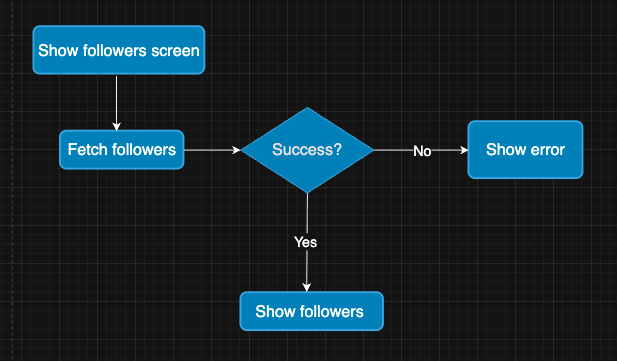
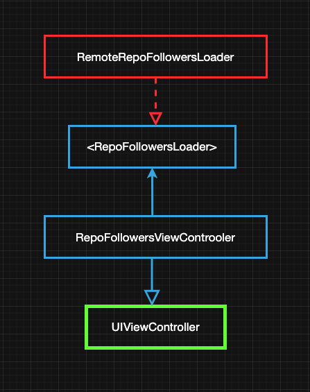

# RepoFollower

## Follower Feature Specs

### Story: User requests to see their followers

### Narrative #1

```
As an user
I want the app to automatically load my followers
So I can always see my followers
```

#### Scenarios (Acceptance criteria)

```
Given the user has connectivity
 When the user requests to see their followers
 Then the app should display the followers 
```

## Use Cases

### Load Follower From Remote Use case

#### Data:
- URL

#### Primary course (happy path):
1. Execute "Load Follower" command with above data.
2. System downloads data from the URL.
3. System validates downloaded data.
4. System creates image follower from valid data.
5. System delivers image follower.

#### Invalid data – error course (sad path):
1. System delivers invalid data error.

#### No connectivity – error course (sad path):
1. System delivers connectivity error.

---

### Load Follower Image Data From Remote Use Case

#### Data:
- URL

#### Primary course (happy path):
1. Execute "Load Image Data" command with above data.
2. System downloads data from the URL.
3. System validates downloaded data.
4. System delivers image data.

#### Cancel course:
1. System does not deliver image data nor error.

#### Invalid data – error course (sad path):
1. System delivers invalid data error.

#### No connectivity – error course (sad path):
1. System delivers connectivity error.

---

## Flowchart



## Model Specs

### Feed Image

| Property      | Type      |
|---------------|-----------|
| `id`          | `Int`     |
| `login`       | `String`  |
| `avatarUrl`   | `URL`     |
| `reposUrl`	  | `URL`     |

### Payload contract

```
GET /users/{username}/followers

200 RESPONSE

[
	{
		"id": 456,
		"login": "a username",
		"avatar_url": "https://a-avatar.url",
		"repos_url": "https://a-repo.url",
	},
	{
		"id": 467,
		"login": "another username",
		"avatar_url": "https://another-avatar.url",
		"repos_url": "https://another-repo.url",
	},
	{
		"id": 458,
		"login": "even another username",
		"avatar_url": "https://even-another-avatar.url",
		"repos_url": "https://even-another-repo.url",
	},
	...
]
```

---

## App Architecture

